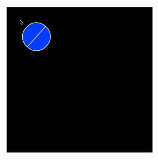
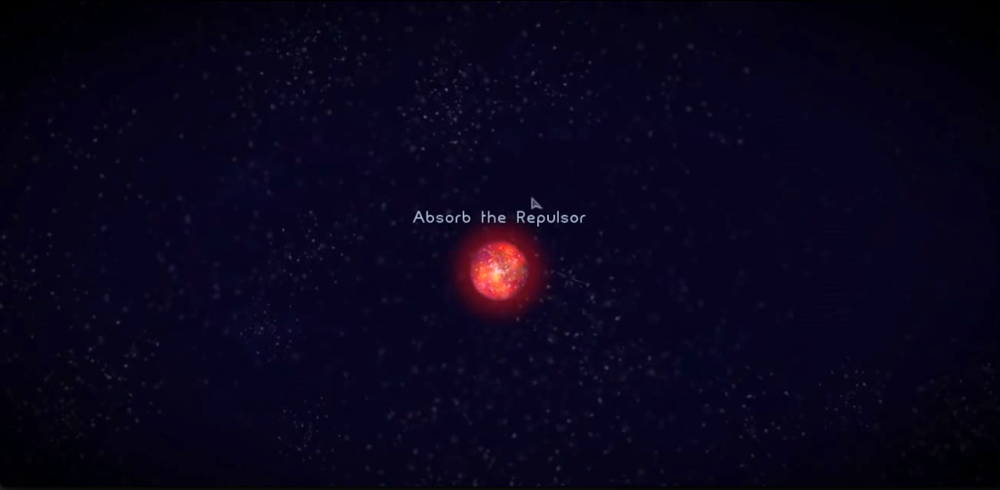

# Cloning Osmos, a lightweight example of object-oriented design

[_Osmos_](http://www.osmos-game.com/) is a beautiful game designed for the iPad and iPhone (but available on all platforms).  In it,
> Your objective is to grow by absorbing other motes. Propel yourself by ejecting matter behind you. But be wise: ejecting matter also shrinks you. Relax... good things come to those who wait. Progress from serenely ambient levels into varied and challenging worlds. Confront attractors, repulsors and intelligent motes with similar abilities and goals as you.

In this project, we've built out some of the simple behavior of this game. including the ability to create blobs, eject them, and conserve mass as they are absorbed by other, bigger blobs.  Because we're dealing with many of the same type of object, with different rules for different types of objects, the ability to define _recipes_ by which we create these objects is a good approach for designing the game.  We're going to build up some similar functionality to Osmos as a way of exploring object-oriented design.

## Suggested Extensions

### Fix the ejecting behavior

Right now, you'll notice that the behavior combining `click` and `eject` doesn't behave _quite_ right.

In particular, sometimes the blobs are ejected in the wrong direction, by what seems to be 180&deg;  This is because of the behavior of the tangent function we use to infer direction.  In particular, because the tangent is defined as a ratio, when both terms are positive or negative, the tangent is positive, so we lose some information about which 'quadrant' the point we're looking at is in.  You can read a bit more about this [here](http://www.mathsisfun.com/algebra/trig-four-quadrants.html).  To fix this behavior, you'll need to consider where the point clicked is relative to the origin of the `#me` blob.  This also creates a subtle error in the CSS transformation for the rotation of a blob on bounce--which you can only notice with the `#me` blob--wherein the blob rotates 'the long way around', _e.g._ rotating 315&deg; (`(360 - 45)`) instead of 45&deg;.  Try to address both of these issues with a single, object-oriented solution.

### Attractors & Repulsors

In the original _Osmos_, you sometimes encounter [blobs which repel you](README_media/Repulsor.png) (and which you repel).

Currently, the blobs--outside of absorbing one another--do not affect one another.  This extension consists of two parts.

1. We've extended the original `Osmos-Demo` to add the notion of a Sun--[a 'subclassed' Blob](https://developer.mozilla.org/en-US/docs/Web/JavaScript/Guide/Details_of_the_Object_Model) which attracts other Blobs to it and absorbs them, but whose mass does not grow.  For the first part of this extension, add the functionality to make the Sun grow as well.

2.  For the second part of this extension, generalize this by adding an attribute `attraction` to `Blob.prototype` which, if it is greater than one, pulls other Blobs toward it, and if it is less than one, pushes them away.  You may want to incorporate the difference in their masses and the distance from one another in this calculation.  Regardless, similar to the way `Blob.prototype.overlappers` works, you'll want to iterate over all blobs and constantly adjust each blob's velocity depending on how many other blobs are attracting or repelling it.

### Adding physical I/O

This extension is broken into two parts: create a physical display _of_ some aspect of the game state, and create a physical interface _to_ some aspect of the game state.

1.  **Input:** Choose some aspect of the game--the total time played, the current mass or speed of the blob, _etc._--to visualize.  Use the BeagleBone to create a physical display of some aspect of the game's state.  _e.g._ You could have an LED whose brightness (or color) reflects the `#me` blob's mass, like an indicator of [hit points](http://en.wikipedia.org/wiki/Health_(gaming)).

2.  **Output:** Choose some aspect of the game state and add a physical interface to control it with the BeagleBone.  This could be [a slider](https://www.sparkfun.com/products/9119) to speed up and slow down your blob via `eject`, a [knob](https://www.sparkfun.com/products/10002) to change your direction, or [a button](https://www.sparkfun.com/products/97) to pause the game.

### Saving a game

JavaScript offers the ability to ['serialize'](http://en.wikipedia.org/wiki/Serialization) objects--this just means that you can take an object and turn it into something you can save to a file.  One of the simplest ways to do this is using [`JSON.stringify`](https://developer.mozilla.org/en-US/docs/Web/JavaScript/Reference/Global_Objects/JSON/stringify), which takes an object and converts it to a string.  You can 'undo' serialization with `stringify` using our friend [`JSON.parse`](https://developer.mozilla.org/en-US/docs/Web/JavaScript/Reference/Global_Objects/JSON/parse).

GitHub offers the [gist](http://gist.github.com/) service, for storing snippets of text and code.  You can do this anonymously for free.  Combine `JSON.stringify` with the [GitHub gist API](https://developer.github.com/v3/gists/#create-a-gist) to make a way to save and load your games' state by pasting in a URL pointing at the gist.

## Useful references

+ On object-oriented design, [Chapter 8 of _Eloquent JavaScript_](eloquentjavascript.net/chapter8.html) is a good text to check out, and the [MDN's page on inheritance](https://developer.mozilla.org/en-US/docs/Web/JavaScript/Guide/Details_of_the_Object_Model) is helpful in understanding the creation of the `Sun` type.

+ MDN's [page on "Working with Object's"](https://developer.mozilla.org/en-US/docs/Web/JavaScript/Guide/Working_with_Objects) provides a nice overview of using `defineProperty` to create accessors.  [This post](http://ejohn.org/blog/javascript-getters-and-setters/) from jQuery creator John Resig explains a bit of the logic behind this feature.

+ For a very brief overview of vectors, check [this page](http://www.mathsisfun.com/algebra/vectors.html) and/or [this video](https://www.youtube.com/watch?v=pimr9I92GZY) out.  For a much more in-depth treatment, check out the [_Feynman Lectures_ chapter](http://www.feynmanlectures.caltech.edu/I_11.html).

+ [BeagleBone example for listening for a button](https://learn.adafruit.com/connecting-a-push-button-to-beaglebone-black/overview)